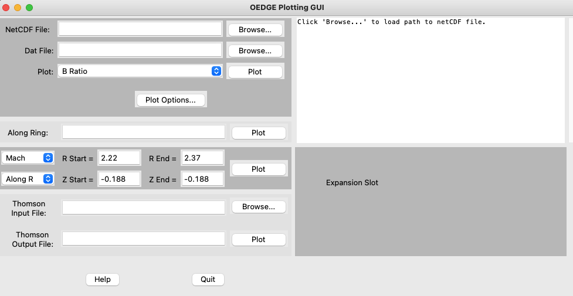

Setting up Your Workspaces
==========================

As mentioned before, this guide sets a user up on the iris cluster at General Atomics. This is because different clusters require different permissions, and it is therefore impossible to make a one-guide-fits-all. Nonetheless, the procedure here is general and it may be possible to read through and adapt for different environments. 

Local Machine Setup
-------------------
The goal of this section is to get the python plotting routines up and running on your machine. The reason we don't use these routines on iris is because the python installations on it do not include the needed packages.

First, you will want to make sure you have python installed. Anaconda (https://www.anaconda.com/) is a very convenient way to install it as it includes most, if not all, the packages we need. The only possibly missing package is ``shapely``, which can easily be installed from a terminal with:

``conda install shapely``

Next, we will clone the OEDGE repository to your own local machine (e.g., your laptop). OEDGE will not be run on your machine, but the python scripts that are used to interface with the output are within the repository. You may place the repository wherever you'd like, such as a central location on your machine where repositories are cloned. The process to clone the repository may be different for different users (e.g., GitHub Desktop or via a terminal), so it is likely easiest to just Google "How to clone a repository" if you are not familiar with the process. 

Now we want to load the plotting GUI to confirm everything works. Similar to cloning the repository, different users have different ways of using python (Spyder, PyCharm, terminal, etc.), so there is no "one-right-way" to launch the GUI. Nonetheless, if one were running from a terminal the commands would be:

.. code-block::

  $ cd /path/to/oedge/repository/python-plots/oedge
  $ python oedge_plots_gui.py

It may be useful to add ``/path/to/oedge/repository/python-plots/oedge`` to your PYTHONPATH environment variable so that you can load the GUI from anywhere. The GUI should look like this (subject to change):

As a final check, we will also be using the underlying plotting routines to make comparisons between OSM-EIRENE predictions of the plasma parameters to actual experimental data. Open up a python interpreter in your preferred fashion and test the module with:

.. code-block::

  >>> import oedge_plots

We will return to the GUI after running OSM-EIRENE and DIVIMP to generate plots of the results. The `oedge_plots` module will be used to write scripts comparing modeling output to experimental data so that we can further refine our model. 

.. note::

  The act of comparing modeling output to experimental data, and then revising the input to the model in order to obtain better agreement with experiment is called *interpretive modeling*. When experimental data is unavailable or you are making predictions for a future experiment, this is called *predictive modeling*. This beginner's guide will demonstrate an interpretive modeling workflow.

Setup on iris
-------------

To begin, you must first be added to the 'oedge' user group on iris. Contact the server administrators (fus@fusion.gat.com) and request to a) be added to the 'oedge' group and b) request access to the ADAS database. You will be sent a User Agreement form for the ADAS data. Once you are added to the 'oedge' group, navigate to ``/fusion/projects/codes/oedge`` and create the following directories:

  1. ``mkdir [iris username]``

  2. ``cd [iris username]``

  3. ``mkdir cases shots results data``

This directory is where all your OEDGE work will live. 

Next you will want to copy over the scripts required to run the codes within OEDGE. Within your OEDGE directory (``/fusion/projects/codes/oedge/[iris username]``) copy:

  1. ``cp /fusion/projects/codes/oedge/zamperinis/rundiv_master.iris .``

  2. ``cp /fusion/projects/codes/oedge/zamperinis/rundiv.sh .``

The first script is the main shell script that runs either OSM-EIRENE or DIVIMP. Since iris uses a scheduler to submit jobs, like most clusters, a slurm script is needed to submit jobs to the queue. That's what the second script is for. 

.. note::

  OSM-EIRENE and DIVIMP share a lot of the same code. In fact, the two codes share the same input file, that's how interconnected they are! This is why you may often hear a background was generated in DIVIMP, but in reality it was made using OSM-EIRENE. 

Now we need to tell the scripts to run in your directory. Open up both files in your text editor of choice (I prefer ``geany``) and change the following lines:

  - In ``rundiv_master.iris``:
    
    - ``PROGDIR=master``
    - ``DATAROOT=/fusion/projects/codes/oedge/[iris username]``
    - ``RUNROOT=/fusion/projects/codes/oedge/[iris username]``
    - ``RESULTSROOT=/fusion/projects/codes/oedge/[iris username]``

  - In ``rundiv.sh``:
   
    - ``echo "srun ./rundiv_master.iris $1 $4 $2 $5 none $3" >> $1.sh``   (we're adding the ``_master``)

Next we will describe how to generate a plasma grid for OSM-EIRENE and DIVIMP to perform their simulations on.
