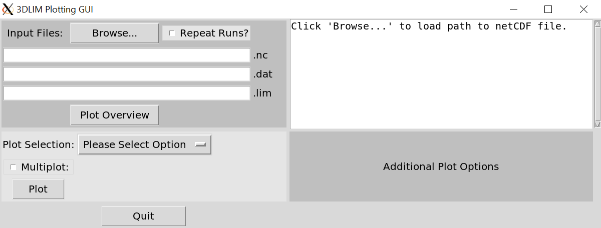

# 3DLIM Plotting GUI
These plotting routines will plot common output of a 3DLIM run. The GUI was intially written by Kenny Bott as part of an undergrad project. The GUI does now contain all the features in lim_plot.py, so it may be worthwhile learning the functions in that script until the GUI is fully developed.

```
$ python3 lim_plots_gui.py &
```


