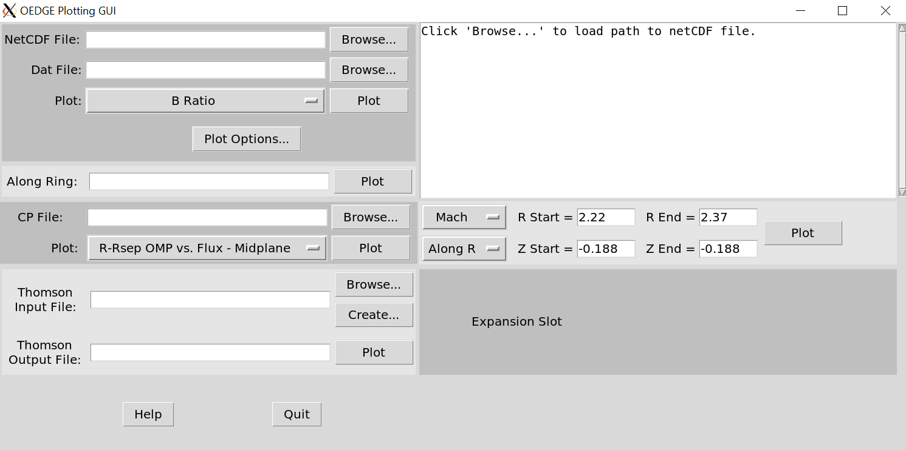
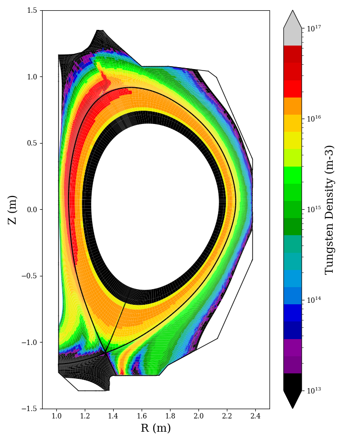
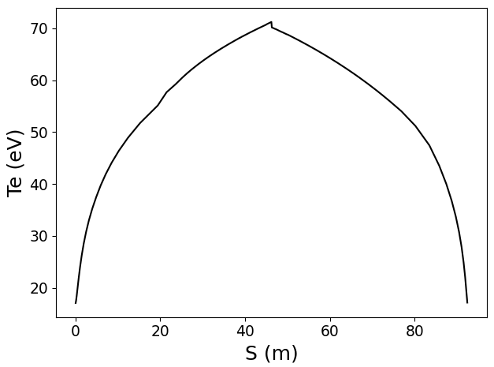
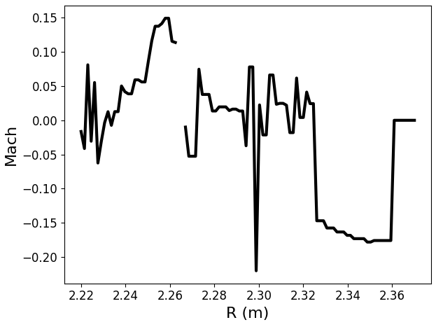
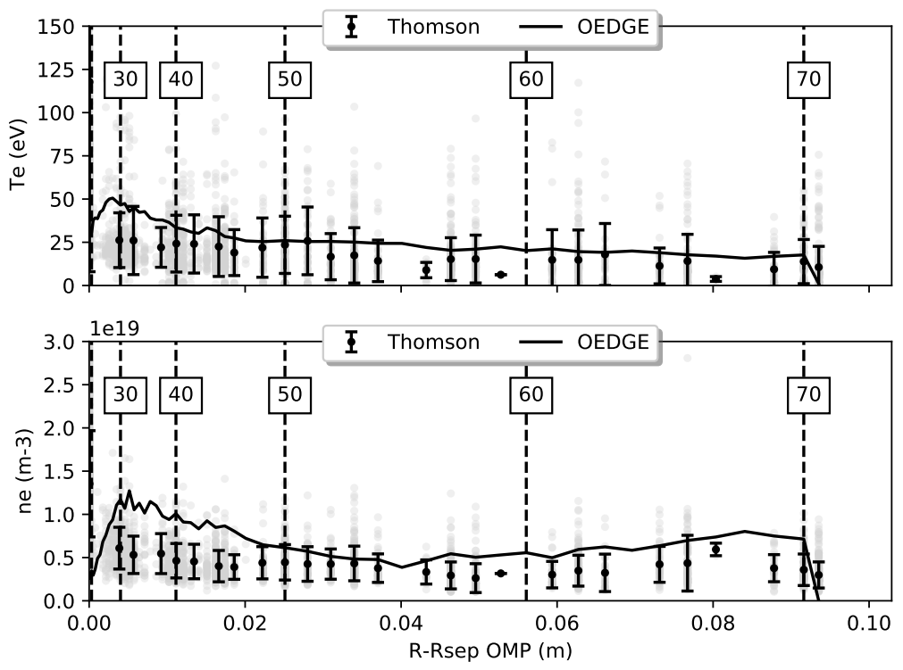

# OEDGE Plotting GUI
This GUI provides an means of vizualizing OEDGE (i.e. DIVIMP) output without needing to use OUT. The GUI is constantly updating and evolving, so this documentation will be regularly updated.

Required packages: tkinter, netCDF4, pandas, numpy, matplotlib.

To open the GUI, at a terminal run:
```
$ python3 oedge_plots_gui.py &
```


From your DIVIMP run, you will need the .nc and .dat file. When clicking Browse... to find the file, it will automatically load in the .dat file if it is in the same folder. The most common operations will be to view 2D plots of various variables. Simply click the dropdown to choose one, and then click Plot. Sometimes the colorbar may need tweaking, or you may want charge resolved data, all of which can be found under Plot Options...

<p align="center">
  
</p>

Data for a selected Plot option can also be plotted along a single ring by entering the ring number in Along Ring and then Plot.

<p align="center">
  
</p>

Data for a hypothetical plunging Langmuir/Mach probe can also be produced from a DIVIMP run by the dialog box on the right. From the drop down one may choose one of Mach number, Te, ne or main ion velocity. The X-axis of the plot can be selected from the dropdown below and can be one of Along R (constant Z), Along Z (constant Z) or Psin. For the R and Z options, choose the range of either R/Z for the plot, and set a constant value for Z/R. 

<p align="center">
  
</p>

When working on generating a plasma background, it is necessary to compare the ne, Te data to upstream Thomson scattering data. This can be done in the lower left box. The following steps can and will be simplified eventually. The Thomson Input File is an Excel file generated from two scripts. It makes sense to take advantage of the powerful Thomson filtering performed by OMFIT, so we do that by using OMFITprofiles. See the steps outlined at the top of create_omfit_excel.py on how to generate this file, omfit_excel_file.xlsx. This is then input into an oedge_plots function to convert it into a file compatible with the DIVIMP grid. For an example:

```
$ python3
>>> import oedge_plots
>>> oedge_plots.create_ts_from_omfit(167196, "/path/to/omfit_excel_file.xlsx", "/save/output/to/ts_167196.xlsx")
```

It may be worthwhile to go into this output file and look at each Thomson chord and manually fiter out any random spikes that may have made it through the analysis. The output file can then be selected as the Thomson Input File by clicking Browse... Then click plot to save the DIVIMP background to Thomson comparison file to a PDF. The PDF name can be modified in the text box Thomson Output File if desired. You can ignore the Create... button. Should be removed probably.

<p align="center">
  
</p>
