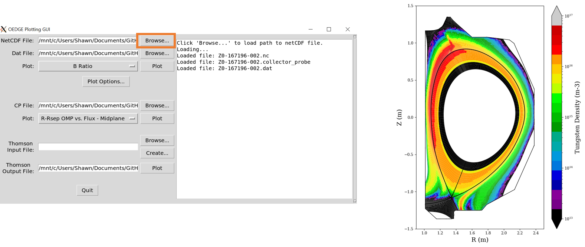

---
Ask Shawn to update the documentation if you need it
---
# OEDGE GUI

This is a GUI written by Shawn Zamperini to plot the results from a DIVIMP run. To run the GUI, simply run oedge_plots_gui from the command line:

```
python3 oedge_plots_gui.py
```

The interface is fairly self-explanatory. Just click browse to load in the path to the NetCDF file from the OEDGE output. The GUI will automatically look in the same folder as the NetCDF file for the .dat and .collectorprobe files of the same run name (if they exist). 

Required packages: tkinter, netCDF4, pandas, numpy, matplotlib.

## Example

An example file just to get up and running is included in this directory, Z0-167196-002.nc (and the .dat and .collectorprobe files as well). Start up the gui, and click the Browse... button next to the NetCDF File entry. This will load in the other files as well. Some plots, like density or temperature, are straightforward; just click the Plot dropdown and see. But others, like the impurity ionization rate, may require a specific charge state. These additional options are found under Plot Options. You can also tweak the colorbar scales as well, or show some specifics to the collector probes (which was the original motivation of this GUI). 



Comparing the plasma density and temperature to Thomson scattering requires a Thomson Input File (a .xlsx file). This file can be created with the Create... prompt, but an example file is included in the repository as well (ts_mapped_167192_167195.xlsx). Open this file to see what's contained in it if you are curious. Load in the file through the Browse... dialog. The output will be generated in a PDF specified in the Thomson Output File entry after clicking Plot (this process may take a minute). Current GUI implementation just chooses a set of rings to plot (20-48, 180-189). Note: These Thomson files are generated for a specific grid/equilibrium! They will not work for a run that was created on a different grid form the one that created the Thomson file!

## Creating a Thomson file for Comparison (DIII-D only)

This process can take a long time, especially if you are connecting remotely as it requires loading in a bunch of gfiles for mapping the Thomson data to the plasma coordinates. Click the "Create..." button to bring up a little dialog asking what shots you wish to pull Thomson data for. The Times specify at what points in the shot you want the data for, so 2500 5000 500 will give you 2500, 3000, 3500, 4000, 4500, 5000 ms. Reference time is the time of the plasma equilibrium at which you want all the Thomson data mapped back to. So if the strike point is swept, this would probably be a point right before the sweep. If the plasma is stationary, then this time shouldn't matter and just put it as the start time. It will be saved as whatever is in Filename. 

### Remote Users

To do this part, you must ssh link your machine to the DIII-D atlas server. This can be done by opening up a separate terminal and typing:

```
ssh -Y -p 2039 -L 8000:atlas.gat.com:8000 username@cybele.gat.com
```
If you do this a lot, it is useful to just alias the command in your .bashrc file. It would be nice if you could run this GUI through NoMachine, but iris only has python2, and this is written in sleek, modern and progressive python3. 

### On-site Users

I don't know, haven't tested it yet because I'm not on-site. Just try running it and let me know if it works or not :)

## Comments

The GUI is in a very early stage, and there are many improvements that can/should be made. If you really crave that extra functionality, the actual functions that produce the plots are very flexible. The primary functions to look at are in the oedge_plots.py file as plot_contour_polygon and compare_ts. 

Report bugs or feature requests to zamp@utk.edu.
